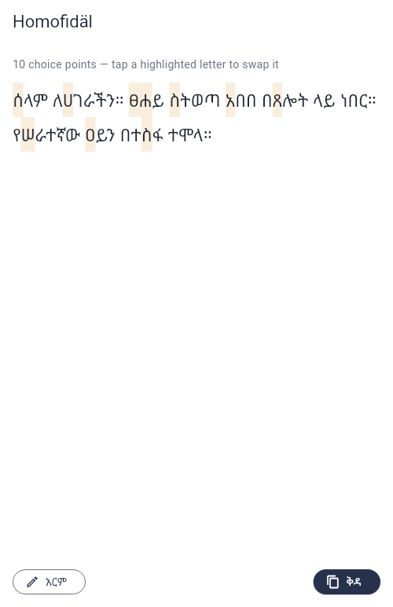
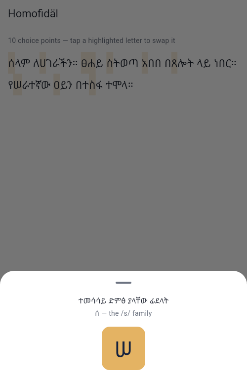
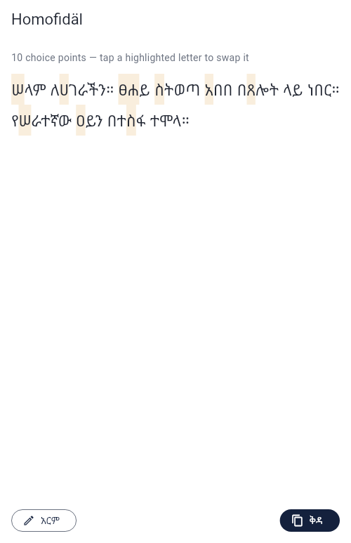
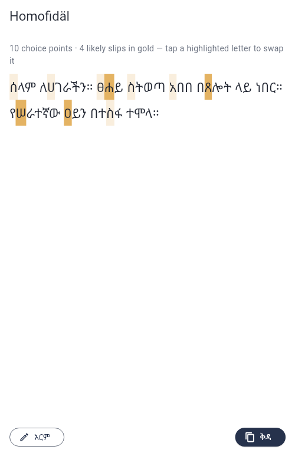
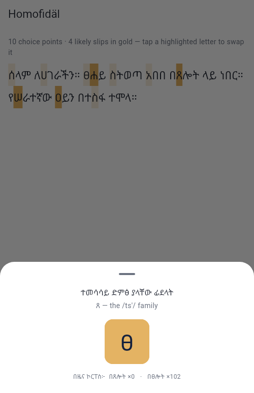
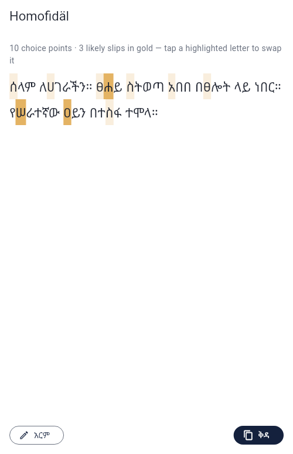

# HomoFidel

An Amharic homophone checker for the Ge'ez script.

Amharic is written in the Ge'ez script (ፊደል / *fidäl*), where several **different** base letters are pronounced **identically**. When you write, you constantly choose between letters that sound the same but are spelled differently — and it's easy to pick the wrong one. Because the wrong choice is still a real, valid letter, the result is a correctly-formed word that is simply the wrong spelling.

Ordinary spell checkers miss this. They catch **non-words**, but a homophone slip is a real-word → real-word substitution that a dictionary happily accepts. HomoFidel targets only that one error class.

**Paste Amharic text → see the homophone-risk letters highlighted → tap any of them to view and apply the same-sound alternatives.** Fully offline, on-device. No backend, no network, no ML.

## Status

**The central interaction works end-to-end (Mode A):** paste or type Amharic → **አረጋግጥ** (Check) → every homophone choice point highlighted → tap a letter → pick a same-sound sibling from the bottom sheet → the text is swapped and re-scanned → **ቅዳ** (Copy) puts the corrected text on the clipboard. A **ናሙና** button pre-fills a sample sentence covering all four families.

**Mode B is in too:** words whose same-sound variant overwhelmingly dominates a bundled news-corpus frequency list get the strong gold *likely slip* highlight, and the swap sheet stars the corpus's pick alongside the raw counts (e.g. `በጸሎት ×0 · በፀሎት ×102`). Evidence, not verdicts — and if the frequency asset ever fails to load, the app silently runs as Mode A.

The engine is pure Dart, fully unit-tested, and the whole flow is covered by bloc and widget tests; the release web build has been driven end-to-end in a real browser. See [NOTES.md](NOTES.md) for the honest breakdown (including Mode B's stated limitations) and screenshots in [docs/screenshots/](docs/screenshots/).

| | | |
|---|---|---|
|  |  |  |
|  |  |  |

## Requirements

Flutter (stable). Developed against Flutter 3.35.7 / Dart 3.9.2.

## Run

The web build needs no device or emulator, so it runs anywhere Flutter is installed — including a plain Linux box.

```bash
flutter pub get

# Web — no device needed
flutter run -d chrome

# Android (device or emulator attached)
flutter run -d android
```

## Test

```bash
flutter test                                  # everything
flutter test test/features/homophone_checker/ # engine + UI feature tests
flutter test --plain-name 'app shell boots into the checker screen'
```

## Build

```bash
# Shareable Android APK → build/app/outputs/flutter-apk/app-release.apk
flutter build apk --release

# Web bundle → build/web/
flutter build web --release
```

## How it works

Every Ge'ez letter is a single Unicode code point in a highly regular block. Each base letter has seven vowel orders occupying **seven consecutive code points**, so the whole mechanic is arithmetic:

- `order = codePoint - base`
- a same-sound sibling is `otherBase + order`

Given a character, the engine checks whether it sits inside one of the homophone families below; if it does, it's a "choice point." Swapping to a same-sound sibling keeps the vowel order and changes the base. No dictionary or network required.

For example ሳ (`U+1233`) is in the S family at order 3, so its sibling is `0x1220 + 3` = ሣ (`U+1223`).

### The four homophone families

| Family | Sound | Base letters |
|---|---|---|
| H | /h/ | ሀ `U+1200` · ሐ `U+1210` · ኀ `U+1280` |
| S | /s/ | ሰ `U+1230` · ሠ `U+1220` |
| Ts' | /ts'/ | ጸ `U+1338` · ፀ `U+1340` |
| A | /ʔ ~ a/ | አ `U+12A0` · ዐ `U+12D0` |

Everyday words where the choice matters: ሰላም (peace/hello), አበበ (a name), ጸሎት (prayer), ፀሐይ (sun), ዐይን (eye).

A family covers exactly **seven** orders (`base` … `base + 6`). The eighth slot is a real but *different* letter — the labiovelar variant, e.g. `0x1237` ሷ SWA — so it must not be flagged.

### Mode B: likely-slip weighting

On top of the deterministic highlighting, each word containing a choice point is checked against `assets/word_freq.json` — 79k word frequencies distilled from ~10.3M tokens of professionally edited Amharic news ([Azime & Mohammed 2021](https://arxiv.org/abs/2103.05639), CC BY 4.0, attribution in the asset's meta block; regenerate with `python3 tool/build_word_freq.py`). A suggestion fires only on lopsided evidence: the same-sound variant needs at least 10 corpus occurrences **and** 20× the typed spelling's count. The corpus is descriptive of newsroom usage, so the UI shows the counts and lets the writer decide.

## Architecture

Clean architecture, one feature slice, with `flutter_bloc` driving the presentation layer.

```
lib/
├── main.dart
├── injection_container.dart          # get_it service locator
├── core/
│   ├── theme/                        # app_colors.dart, app_theme.dart
│   ├── error/                        # failure types
│   └── usecases/                     # base UseCase contract
└── features/homophone_checker/
    ├── domain/                       # pure Dart — no Flutter imports
    │   ├── entities/                 # HomophoneFamily, FlaggedLetter
    │   ├── repositories/             # abstract contract
    │   └── usecases/                 # ScanText, SwapLetter
    ├── data/
    │   ├── datasources/              # family tables; Mode B word list
    │   ├── models/                   # DTOs / JSON mapping
    │   └── repositories/             # contract implementation
    └── presentation/
        ├── bloc/                     # CheckerBloc + events + states
        ├── pages/                    # home_page.dart — the one screen
        └── widgets/                  # highlighted_text.dart, swap_sheet.dart
```

Dependencies point inward: `presentation → domain ← data`. The **domain layer is pure Dart with no Flutter imports**, so the detection logic can be unit-tested without a widget harness and reused later (for example, inside a keyboard/IME).

> Note: spec §7/§8 specify Provider/`ChangeNotifier` and call BLoC "overkill at this size." This repo deliberately diverges — see [NOTES.md](NOTES.md).

## Design

The palette is sampled from the concept spec rather than invented: navy `#14213D` is the document's header block and gold `#E4B363` its accent text — the same pairing it already uses for fidäl on the cover.

| Token | Colour | Role |
|---|---|---|
| `navy` | `#14213D` | Primary. App bar, icon plate |
| `gold` | `#E4B363` | Secondary. Accent, likely-error highlight |
| `surface` | `#F5F6F9` | Light containers |
| `ink` | `#1F2430` | Body text; dark-mode surface |
| `muted` | `#6B7280` | Labels, interactive borders |

Gold reads **8.31:1** on navy but only **1.92:1** on white, so it is a background or dark-surface accent and never a foreground colour on a light surface. Every pairing in `AppColors` is contrast-checked; the two highlight weights implement the spec §14 mitigation for Mode A noise — a quiet wheat tint (`choicePoint`) for "you chose here" against full-strength gold (`likelyError`) for "this is probably wrong."

The app icon is ፊ (`U+134A`, the first letter of ፊደል) in gold on a navy plate. Regenerate with:

```bash
python3 tool/generate_icon.py     # redraw assets/icon/ from the font
dart run flutter_launcher_icons   # stamp Android + web
```

Ge'ez text is rendered in **Noto Sans Ethiopic**, bundled rather than system-resolved — the default font has no Ethiopic glyphs and web cannot rely on the host having one. SIL OFL 1.1; the licence ships in `assets/fonts/OFL.txt` and is registered into the app's Licenses page.

## Scope

A deliberately tight proof of concept, not a production app.

**In scope:** paste/type Amharic; detect characters in a homophone family; highlight them as choice points; tap a letter → see same-sound siblings → tap to swap; copy the result; works fully offline.

**Out of scope:** a full Amharic dictionary or grammar checker; one-click "fix everything" autocorrect; system-wide keyboard/IME; accounts, cloud sync, analytics; iOS release and Play Store publishing.

HomoFidel flags the choice points — it does **not** claim to be the authority on which spelling is correct. Without a dictionary it can only offer the options; it's an assist, not an authority.

## Docs

Full concept & technical specification: [docs/Homofidel_Concept_Spec.pdf](docs/Homofidel_Concept_Spec.pdf)
